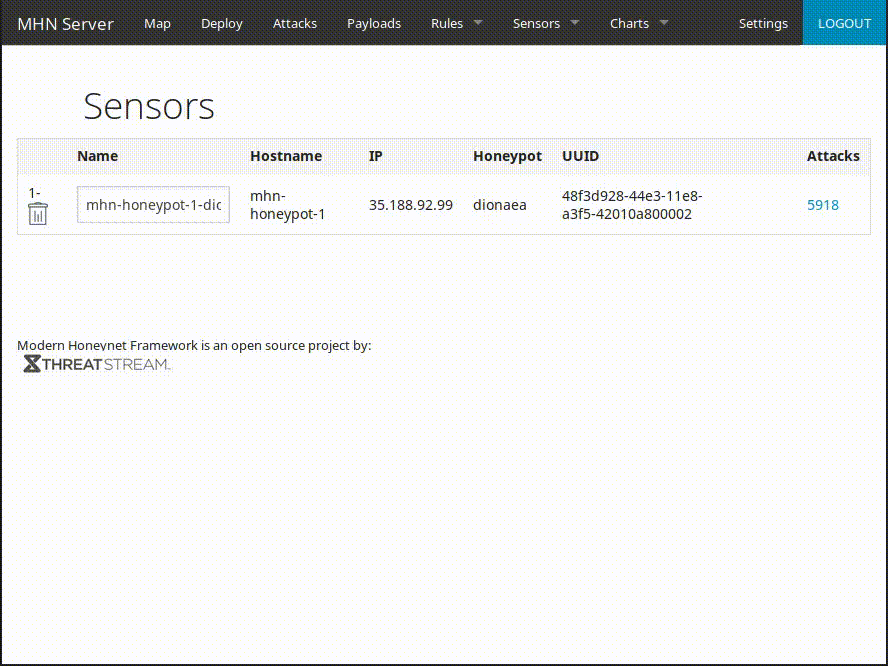

# Project 9 - Honeypot

Time spent: 4 hours spent in total and more to leave the honeypot active

> Objective: To allow honeypot to be active and intercept some attempted attacks.

## Which Honeypot(s) you deployed

* Dionaea over HTTP

## Any issues I've encountered

I needed to open port 80 when trying to access the UI panel of my mhn-admin on my GCP console.

## A summary of the data collected:

Number of attacks: 5918 at the time of writing this README

## Any unresolved questions raised by the data collected

None

## GIF of Admin Panel

## Resources

- [MHN](https://github.com/threatstream/mhn)
